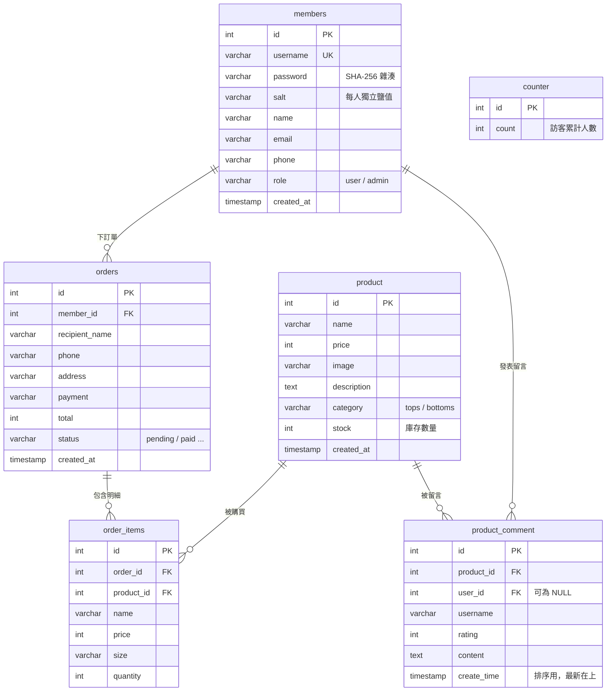

# STANDARD DAY 資料庫設計（ERD）

統一資料庫：**`shopdb`**（`utf8mb4` / `utf8mb4_unicode_ci`，支援中文）
建表與種子資料請見 [`schema.sql`](schema.sql)。

## ER 圖

> `counter` 為單列計數表，與其他表無外鍵關聯，故獨立於關係圖之外。

## 資料表說明

| 資料表 | 用途 | 對應功能 / 負責人 |
|--------|------|------------------|
| `members` | 會員帳號、登入資訊 | 登入控制④、密碼雜湊(加分) ／ 組員C・D |
| `product` | 商品資料、庫存 | 商品陳列①、庫存②、搜尋⑤ ／ 組員A・B |
| `product_comment` | 商品留言 / 評價 | 留言板③ ／ 組員C |
| `counter` | 訪客計數器 | 計數器⑥ ／ 組員C |
| `orders` / `order_items` | 訂單與明細 | 購物車結帳(延伸①)、管理者訂單(延伸③) ／ 組員B |

## 與既有程式的對應（為何這樣設計）

- `members(name, email, phone)` ← `member.jsp` 的 `SELECT name, email, phone WHERE id=?`
- `members(username, password, salt)` ← `login_process.jsp` 改為取出 salt+hash 後比對（不再比對明文）
- `product(name, price, image, description)` ← `product.jsp` 的 `SELECT * FROM product WHERE id=?`
- `product_comment(... ORDER BY create_time DESC)` ← `product.jsp` 留言列表「最新在最上」
- `counter(count)` ← `index.jsp` 訪客計數器（已由原 `counter` 資料庫移入 `shopdb`）

## 新增欄位（為日後功能預留）

- `product.stock`：組員B「購買後庫存減少」。
- `product.category`：分類頁 / 搜尋。
- `members.role`：管理者功能（上架商品、瀏覽訂單）。
- `orders` / `order_items`：組員B 結帳與訂單瀏覽。
